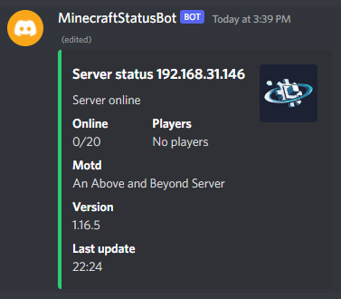

# MCSatusDSBot
**M**ine**c**raft server **status** **d**i**s**cord **bot**
Created with:
- .NET 6.0
- C#
- [Discord.Net](https://discordnet.dev/index.html)
  - Slash commands
- [.NET Generic Host](https://docs.microsoft.com/en-us/dotnet/core/extensions/generic-host)
  - [Discord.Addons.Hosting](https://github.com/Hawxy/Discord.Addons.Hosting)
  - Dependency injection
- [Serilog](https://serilog.net/)
- Entity framework
- [Minecarft query lib](https://github.com/sakamoto-poteko/MinecraftServerStatus)

This project is kinda practic lesson to learn these things

## Development
- Set dotnet secrets
  - dotnet user-secrets set "Token" "12345"
  - dotnet user-secrets set "DevGuild" "12345"
- Run profile from `MCSatusDSBot/Properties/launchSettings.json`

## ToDo
- Sharding
- Notifications
- Localizing
